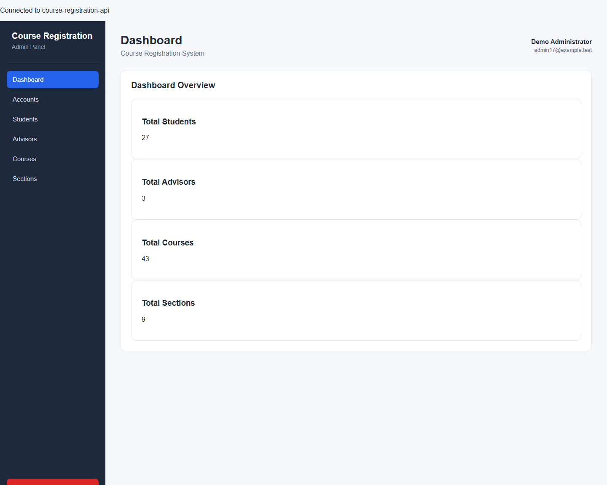
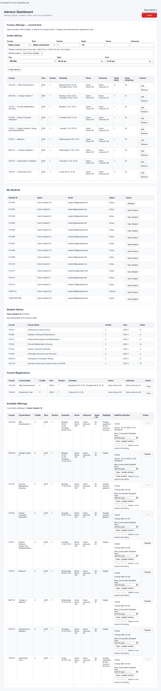
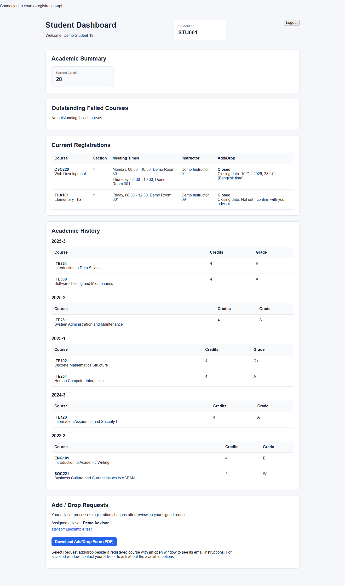
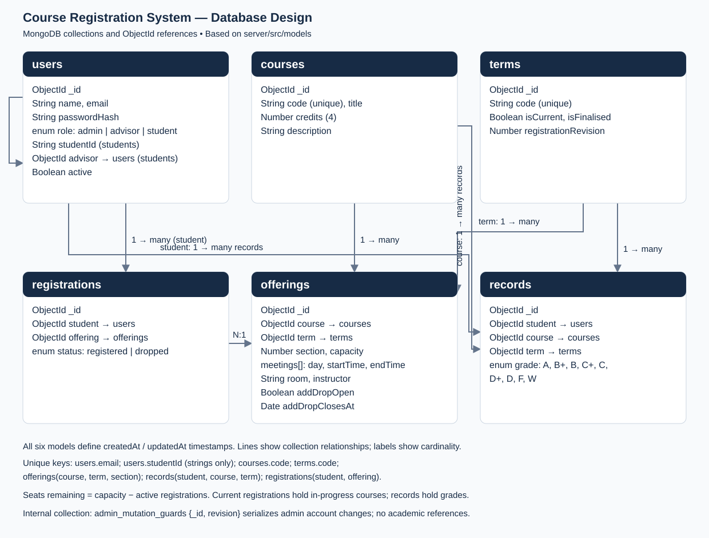

# Course Registration System

**CSC220 / ITE220 — Web Development II | Stamford International University | Trimester 1/2026**

A full-stack **MERN** web application for managing university student accounts, course offerings, registrations, academic records, and advisor-reviewed Add/Drop requests. The system has separate dashboards for **Administrators**, **Academic Advisors**, and **Students**.

- **Repository:** https://github.com/Captansleepy/ITE220-Final-Project-Course-Registration-System
- **Status:** Core features are implemented. Dashboard screenshots and the database diagram are included below. Automated checks and an isolated Atlas acceptance command are provided; submission and presentation tasks are listed under Project Status.
- **Submission deadline:** 10/11/26, 11:59 PM.

## Team Members and Responsibilities

| Team member | Student ID | Project role | Main responsibility |
| --- | --- | --- | --- |
| Rachaphon Bhetcharut | 2306020001 | Team Lead / Integrator | GitHub repository, code reviews, merging, integration, final delivery |
| Sham Bahadu | 230710005 | Backend Developer | Express API, JWT authentication, validation, registration rules, integration |
| Panruethai Thubthimthong | 2303080018 | Database & Data Lead | Mongoose models, anonymized dataset, seed script, MongoDB relationships |
| Hathairat Deesrisuk | 2105110008 | Frontend A | Admin and Advisor dashboards |
| Trithep Sik | 2406100007 | Frontend B | Login, Student dashboard, shared frontend components |

The team collaborates through Git branches and pull requests. Sham also implemented the final student Add/Drop request flow and advisor window controls.

## Technology Stack

| Layer | Technology |
| --- | --- |
| Frontend | React, Vite, React Router, JavaScript, CSS |
| Backend | Node.js, Express |
| Database | MongoDB Atlas, Mongoose |
| Authentication | JSON Web Tokens (JWT), bcryptjs password hashing |
| Testing | Node.js built-in test runner, frontend production build, Oxlint |
| Collaboration | Git and GitHub pull requests |

## Key Features

### Administrator — `/admin`

- View user accounts and filter by role (student, advisor, admin).
- Create student, advisor, and administrator accounts with appropriate details.
- Edit supported account information, including name, email, role, student ID, assigned advisor, and active status.
- Deactivate accounts after confirmation while preserving their academic references.
- Protect the current administrator from self-removal and check that at least one active administrator remains.
- View course and section information.

**Important:** The `DELETE /api/admin/users/:id` endpoint performs **deactivation**, not permanent physical deletion. This deliberately preserves registrations and academic records. Admin updates and deactivation share a transaction guard to protect the last active administrator.

### Academic Advisor — `/advisor`

- View only students assigned to the logged-in advisor and examine their individual grade history.
- View current registrations and available offerings for each assigned student.
- See eligibility and clear reasons when a section is unavailable.
- Register an eligible student; drop an existing registration with confirmation.
- Create, edit, and remove course offerings for the current, non-finalized term.
- Specify course, section, teaching schedule, instructor, room, and capacity.
- Display occupied and remaining seats for the current term.
- Open, update, or close each offering's Add/Drop request window.

For safety, an offering with **registration history** cannot be deleted. Existing registration history also restricts changes to an offering's identifying or timetable fields. Capacity cannot be set below current enrollment.

### Student — `/student`

- View the logged-in student's name and student ID.
- View **current registrations** with course, section, schedule, room, and instructor.
- View **academic history**, grouped by term and showing grades.
- View earned credits without double-counting a course already passed.
- See outstanding failed courses marked **Retake required**.
- See each registered course's Add/Drop status and closing date in Bangkok time.
- Download a fillable Add/Drop request PDF.
- View the assigned advisor's email and course-specific request instructions.

### Registration and Eligibility Rules

The backend applies the registration rules for an advisor choosing a section:

1. Only offerings in a **current, non-finalized term** can be registered.
2. A course already passed with **D or higher** cannot be taken again.
3. A course graded **F** is flagged **Retake required** until passed; a **W** course may be taken again.
4. A full section cannot accept additional registrations.
5. A new section cannot overlap the student's current timetable.
6. A student cannot register twice for the same course in the same term, including a different section.

Excluded offerings remain visible with reasons such as **Already passed**, **Full**, or **Clashes with CSC220 Section 2**. Register/drop operations use MongoDB transactions. The opt-in Atlas acceptance checks exercise two simultaneous registrations competing for one seat.

### Student Add/Drop Request Process

Add/Drop **requests are not automatic registration changes**. They follow the paperwork process required by the project brief:

1. The advisor opens the request window for an offering and sets a future closing date.
2. The student sees the open/closed status on the Student dashboard.
3. The student selects **Request add/drop** and downloads the form.
4. The student fills and signs the PDF, then emails the file to the assigned advisor.
5. The advisor reviews the request and manually makes any approved registration change.

Required email subject:

```text
Add/Drop Request - <Student ID> - <Course Code>
```

The **Email advisor** link prepares the address and subject using the student's email application. The student must attach the completed PDF themselves; no automatic outgoing email is sent.

Form path: [`client/public/forms/add-drop-request.pdf`](client/public/forms/add-drop-request.pdf). Additional instructions: [`docs/student-add-drop.md`](docs/student-add-drop.md).

## Dashboard Screenshots

Screenshots captured from the running application. Names and email addresses are anonymized for documentation.

### Administrator



### Academic Advisor



### Student



## Database Design Diagram



[Download the one-page database diagram (PDF)](docs/database-diagram.pdf) · [Open printable diagram](docs/database-diagram.html)

## Repository Structure

```text
ITE220-Final-Project-Course-Registration-System/
├── client/
│   ├── public/forms/add-drop-request.pdf
│   └── src/
│       ├── components/
│       ├── pages/
│       │   ├── Login.jsx
│       │   ├── AdminDashboard.jsx
│       │   ├── AdvisorDashboard.jsx
│       │   └── StudentDashboard.jsx
│       ├── App.jsx
│       └── api.js
├── server/
│   ├── src/
│   │   ├── config/
│   │   ├── controllers/
│   │   ├── middleware/
│   │   ├── models/
│   │   ├── routes/
│   │   └── utils/
│   ├── tests/
│   ├── seed.cjs
│   ├── seed-config.json
│   └── CSC220-Project-Info_final_1.xlsx
├── docs/
│   ├── advisor-registration-api.md
│   └── student-add-drop.md
└── README.md
```

## Requirements

- **Node.js 24** is recommended; this is the version used in the GitHub CI workflow.
- npm, included with Node.js.
- Git.
- A MongoDB Atlas connection and a **separate empty database** for seed/integration testing.
- Windows PowerShell or another shell with equivalent commands.

## Installation and Local Setup (Windows PowerShell)

### 1. Clone the repository

```powershell
git clone https://github.com/Captansleepy/ITE220-Final-Project-Course-Registration-System.git
cd ITE220-Final-Project-Course-Registration-System
```

**To review the submission-readiness changes before merging**, check out the review branch:

```powershell
git fetch origin
git switch --track origin/fix/submission-readiness
```

If the local branch already exists, use `git switch fix/submission-readiness` followed by `git pull --ff-only origin fix/submission-readiness`.

### 2. Configure the backend

```powershell
cd server
npm ci
Copy-Item .env.example .env
```

Fill **`server/.env`** locally; never commit it:

| Variable | Required | Purpose |
| --- | --- | --- |
| `MONGODB_URI` | Yes | MongoDB Atlas connection string |
| `MONGODB_DB_NAME` | Yes | Target database name |
| `JWT_SECRET` | Yes | Random signing secret, at least 32 characters |
| `PORT` | Optional | API port; defaults to 5001 |
| `CLIENT_ORIGIN` | Optional | React URL allowed by CORS; defaults to `http://localhost:5173` |
| `SEED_PASSWORD` | For seeding | Local demo password, at least 12 characters |
| `SEED_FILE` | Optional | Alternate Excel workbook for seeding |
| `DNS_SERVERS` | Optional | Custom DNS resolvers for Atlas access |

**Security:** Do not paste credentials, database passwords, JWTs, `.env` contents, or a real person's academic records into GitHub issues, screenshots, or pull requests.

### 3. Configure the frontend

In a **second PowerShell terminal**, run from the project root:

```powershell
cd client
npm ci
Copy-Item .env.example .env
```

Set `client/.env` to:

```dotenv
VITE_API_URL=http://localhost:5001/api
```

The backend must be running on that port. The frontend client also defaults to `http://localhost:5001/api` when this variable is not set.

### 4. Start both servers

**Backend terminal (inside `server`):**

```powershell
npm run dev
```

**Frontend terminal (inside `client`):**

```powershell
npm run dev
```

Open **http://localhost:5173** and log in using a valid test account.

The API health endpoint is **http://localhost:5001/api/health**. A successful health response shows that this endpoint answered; **it does not prove** that role dashboards can read and save database data.

## Database and Seed Data

### Collections and relationships

| Collection | Main responsibility |
| --- | --- |
| `users` | Admin, advisor, and student accounts; students reference assigned advisors |
| `courses` | Course codes, titles, and credits |
| `terms` | Term codes, current/finalized state |
| `offerings` | Course/term sections, meeting times, capacity, instructor, and Add/Drop settings |
| `registrations` | Student-to-offering registrations, including registered/dropped status |
| `records` | Completed-course grades and academic history |

The seed uses historical completed grades in `records`; **in-progress courses are stored as current registrations**, not as completed grade records.

### Preview the source data without writing to MongoDB

From the **`server` directory**:

```powershell
npm run seed:preview
```

This validates workbook and seed configuration without connecting to or changing the database.

### Seed a NEW EMPTY development database

**Never run the seed against the shared populated Atlas database.** The importer refuses databases with existing collections.

1. Set `MONGODB_DB_NAME` to a new name of the form `course_registration_seed_<testname>`.
2. Set `SEED_PASSWORD` to a **local demo password** at least 12 characters long.
3. Verify the workbook contains **invented student and advisor names/emails**, not real personal data.
4. Run, from `server`:

```powershell
npm run seed:preview
npm run seed
```

The seed imports `CSC220-Project-Info_final_1.xlsx` using `seed-config.json`.

The **historical original seed** reported 25 students, 2 advisors, 1 admin, 43 courses, 10 terms, 9 current-term offerings, 237 grade records, and 13 registrations. These are **initial import counts**, not guaranteed current Atlas totals.

The seed writes generated demo names and `example.test` emails for all users, while preserving invented student IDs and advisor assignments. The source workbook must also contain invented identities. Run `npm run test:integration` from `server` to verify a fresh seed, academic references, login, and persistence in a newly created isolated Atlas database.

## Demonstration Login Accounts

Use a **newly seeded test database** or disposable demo accounts. The seed applies the locally configured `SEED_PASSWORD` to its accounts.

| Role | Seeded username/email | Password |
| --- | --- | --- |
| Admin | `admin@example.test` | Your locally configured `SEED_PASSWORD` |
| Advisor | `advisor001@example.test` | Your locally configured `SEED_PASSWORD` |
| Student | `student001@example.test` | Your locally configured `SEED_PASSWORD` |

> Before LMS submission, confirm the three demo accounts actually work. Provide the lecturer with valid **demo-only** credentials using an approved secure channel. Do not publish shared Atlas account passwords or real credentials in this public repository.

These addresses apply to fresh imports with the current seed. Existing databases keep their existing accounts. Additional demo emails follow `advisor002@example.test` and `student002@example.test` through `student025@example.test`. No database login accounts are changed by updating the source code.

## Main REST API Routes

All routes are under `/api`; relevant role checks are performed by backend middleware.

| Method | Route | Role / purpose |
| --- | --- | --- |
| POST | `/auth/login` | Authenticate a user |
| GET | `/auth/me` | Authenticated current-user details |
| GET | `/admin/users` | Admin: list/filter accounts |
| POST | `/admin/users` | Admin: create account |
| PATCH | `/admin/users/:id` | Admin: edit account |
| DELETE | `/admin/users/:id` | Admin: safely deactivate account |
| GET | `/admin/courses` | Admin: list courses |
| GET | `/admin/sections` | Admin: list sections |
| GET | `/advisor/students` | Advisor: assigned students |
| GET | `/advisor/students/:id/history` | Advisor: student-specific grades |
| GET | `/advisor/catalog` | Advisor: current terms and available courses |
| GET | `/advisor/offerings` | Advisor: current-term offerings and seat counts |
| POST | `/advisor/offerings` | Advisor: create offering |
| PATCH | `/advisor/offerings/:offeringId` | Advisor: edit offering |
| DELETE | `/advisor/offerings/:offeringId` | Advisor: remove unused offering |
| PATCH | `/advisor/offerings/:offeringId/add-drop` | Advisor: open/close request window |
| GET | `/advisor/students/:id/offerings` | Advisor: eligibility |
| GET | `/advisor/students/:id/registrations` | Advisor: current registrations |
| POST | `/advisor/students/:id/registrations` | Advisor: register |
| DELETE | `/advisor/students/:id/registrations/:registrationId` | Advisor: drop |
| GET | `/student/dashboard` | Student: own history, registrations and advisor contact |

For request bodies and the rule engine, see [Advisor registration API documentation](docs/advisor-registration-api.md) and [Student Add/Drop documentation](docs/student-add-drop.md).

## Testing

### Automated checks

From the **project root**:

```powershell
npm ci --prefix server
npm test --prefix server

npm ci --prefix client
npm run build --prefix client
npm run lint --prefix client
```

GitHub Actions also runs these checks for pull requests. A passing test suite and successful build are necessary checks but **do not guarantee** successful live Atlas transactions or correct behavior in every browser.

Validation of the submission-readiness changes: **38 backend tests passed**, frontend build and lint passed, seed preview passed, and **10 groups of live Atlas acceptance checks passed** in an isolated freshly seeded database. The live checks include password login for all three demo roles, persistence, academic rules, and simultaneous seat/admin requests. The Atlas run emits Mongoose deprecation warnings for existing `new: true` query options; these did not fail the checks. PDF fill/save and email-client behavior still require a human walkthrough.

### Live Atlas acceptance checks

From `server`, after configuring `MONGODB_URI` in `.env`:

```powershell
npm run test:integration
```

This opt-in command creates a new `course_registration_seed_<compact-timestamp><random-suffix>` database, seeds it, and checks real password login, roles, academic references, account/offering persistence, retakes, passed-course exclusions, full sections, clashes, seat counts, drop/re-registration, term finalisation, and Add/Drop status. It generates temporary test credentials internally and does not print them. It never writes to the configured `MONGODB_DB_NAME` or deletes a database. The isolated database is retained for inspection; it contains extra acceptance fixtures in addition to the seeded dataset. It requires Atlas access and permission to create the new database. This complements the unit tests and does not replace PDF/email-client or presentation checks.

### Browser and paperwork checks

Use an isolated development database and disposable accounts to verify:

- Log in as all three roles and confirm frontend and backend role restrictions.
- Create/edit/deactivate a disposable account; verify persistence and last-admin restrictions.
- Create/edit/remove an offering **without registrations**.
- Verify an offering with registration history cannot be deleted.
- Register an eligible student and confirm seats remaining decrease.
- Verify already-passed, full, and timetable-clashing offerings are blocked with reasons.
- Verify an F course is labelled **Retake required**.
- Drop and re-register a disposable registration without altering academic grade history.
- Open and close an Add/Drop request window and confirm the student-facing status updates.
- Download, fill, save, and reopen the form; confirm email subject and advisor email.
- Confirm requesting the paperwork **does not** automatically change registrations.

**Tip:** Use separate browser profiles for Advisor and Student during simultaneous demos because tabs at the same origin share login storage.

## Project Status and Known Limitations

| Area | Implementation / evidence | Remaining verification / work |
| --- | --- | --- |
| MongoDB models and seed | Implemented; fresh seed/reference acceptance checks provided | Verify curriculum realism and source-workbook anonymization with the team |
| Authentication and role authorization | Implemented; unit and real password/role acceptance checks provided | Give the marker valid demo credentials for the database they will use |
| Admin account management | Implemented with safe deactivation, persistence and simultaneous last-admin acceptance checks | Final browser walkthrough |
| Advisor offering CRUD | Implemented with guarded operations and persistence checks | Final browser walkthrough |
| Eligibility, registration and dropping | Implemented; confirmation before registration; unit, live persistence and simultaneous seat acceptance checks provided | Final browser walkthrough |
| Advisor add/drop windows | Implemented; live deadline/status acceptance checks provided | Verify the browser's deadline display |
| Student records and Add/Drop paperwork | Implemented; screenshots and fillable PDF included | Fill/save/reopen the PDF and try the email link in the intended email client |
| Documentation and submission | README, three screenshots and one-page database diagram included | Group report, individual peer evaluations, lecturer collaborators, LMS uploads and presentation preparation |

Cloud deployment is **optional**, not a required core function.

## Academic Integrity and Acknowledgements

This group project uses tutorials, libraries, and AI assistance where appropriate. AI-assisted implementation and documentation should be described honestly in the group report, together with how team members tested, reviewed, and understood the generated code. All members should be prepared to explain their own contribution in the live presentation.

---
**Course Registration System — CSC220 / ITE220, Trimester 1/2026**
